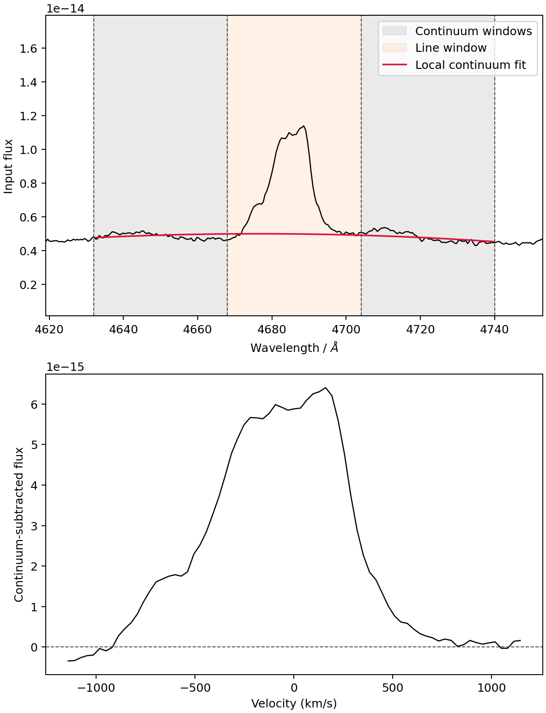
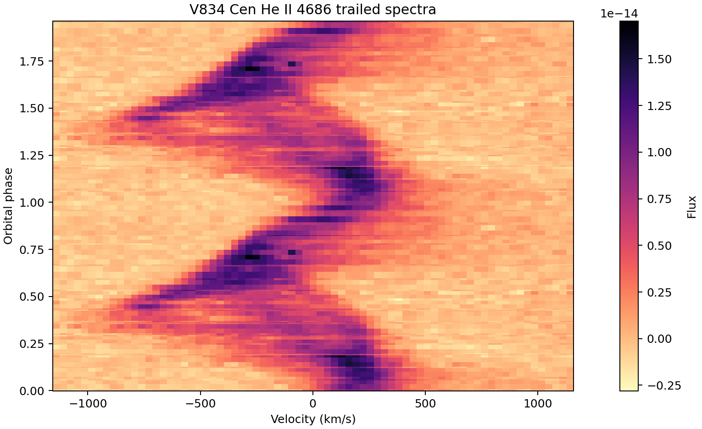
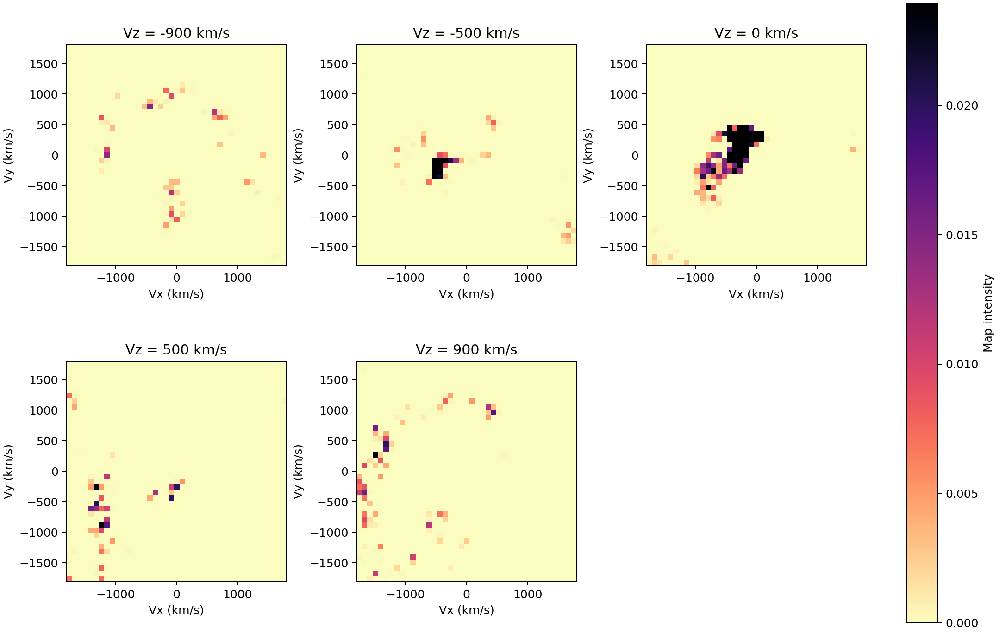
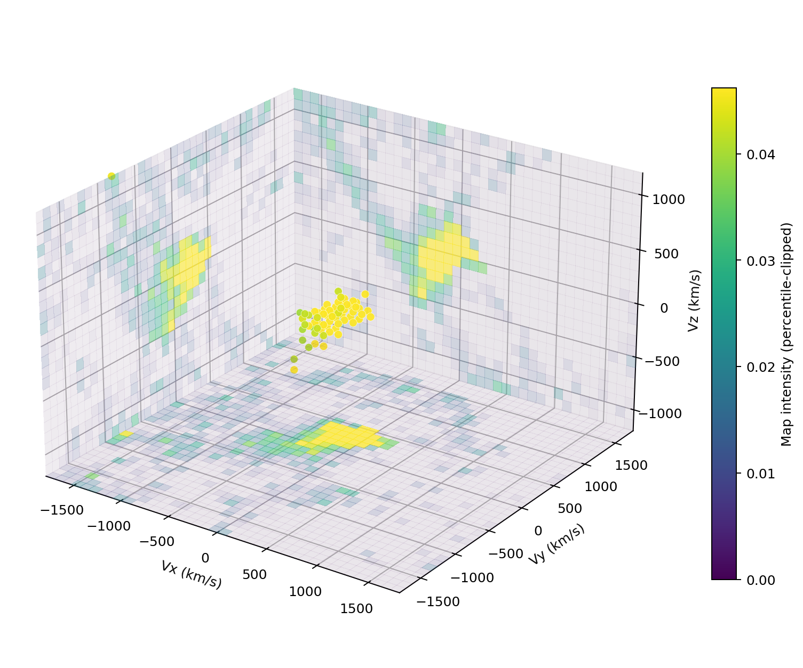
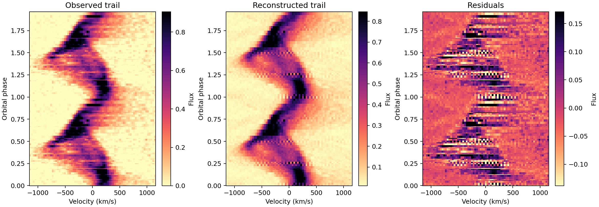

# PyDoppler3D

  [](https://github.com/fcotizelati/pydoppler3d/actions/workflows/ci.yml)
  

  This is a pure-Python prototype for three-dimensional Doppler tomography of
  phase-resolved emission-line spectra. It follows the same practical data
  workflow as PyDoppler where possible, but replaces the classic 2D tomogram by
  a velocity cube with coordinates `(Vx, Vy, Vz)`.

  The code can currently:
  - [x] Load text spectra + phase-file layouts used by PyDoppler and doptomog
  - [x] Continuum-subtract a single emission line and write trailed spectra
  - [x] Run a bounded L-BFGS-B maximum-entropy 3D reconstruction with analytic
        gradients from the forward projector and transpose
  - [x] Plot trailed spectra, reconstructed trails, and residuals
  - [x] Plot 3D maps as `Vx-Vy` slices, `Vz`-collapsed projections, static 3D
        previews, and interactive HTML isosurfaces
  - [ ] Provide a production-grade replacement for MEMSYS/trm-doppler
  - [ ] Quantify uncertainties and 3D artefacts for publication-grade use

  This repository is inspired by Marsh (2022), *Three dimensional Doppler
  tomography*, MNRAS, 510, 1340
  (https://doi.org/10.1093/mnras/stab3335), and by the existing PyDoppler
  workflow.

  ## Acknowledgment

  If you make use of this software, please acknowledge the relevant method and
  data sources:
   * Marsh 2022, MNRAS, 510, 1340
   * Spruit 1998, arXiv, astro-ph/9806141
   * Kotze et al. 2016, A&A, 595, A47 for the bundled V834 Cen doptomog data
   * Echevarria et al. 2007, AJ, 134, 262 for the bundled U Gem spectra
   * the original PyDoppler project when using its 2D workflow/data convention

  ## Requirements & Installation

  PyDoppler3D is 100% Python source. It has no custom C++ extension and does not
  require a Fortran compiler. The numerical work is done with NumPy and SciPy.
  The main inversion uses SciPy's L-BFGS-B optimizer with the package's exact
  forward and transpose projection operators.

  Python >=3.10 is required. The package is tested through Python 3.14.

  From the repository root:

  ```bash
  python -m pip install -e ".[plot,volume]"
  ```

  For development:

  ```bash
  python -m pip install -e ".[dev]"
  pre-commit install
  ```

  Pull requests are checked with Ruff, pytest coverage, and package-build jobs
  on GitHub Actions for Python 3.10 through 3.14.

  ##  Section 1:  Usage

  You can use the `sample_script.py` file to run the same tutorial-style workflow
  shown below:

  ```bash
  python sample_script.py
  ```

  This copies the bundled V834 Cen magnetic-CV data, prepares the spectra,
  performs a small 3D reconstruction, and writes figures into `output_images/`.

  ### Quick start for automated workflows

  ```python
  from pathlib import Path
  import numpy as np

  from pydoppler3d import (
      MemConfig,
      VelocityGrid3D,
      copy_test_data,
      load_v834cen_dataset,
      mem_reconstruct,
      plot_map_slices,
  )
  from pydoppler3d.data import DopplerMap

  workdir = Path.cwd() / "pydoppler3d-workdir"
  copy_test_data(workdir, overwrite=True)

  prepared = load_v834cen_dataset(workdir / "v834cen")

  spectra = prepared.spectra
  data = np.clip(spectra.flux, 0.0, None)
  scale = np.nanpercentile(data, 99.0)
  data = data / scale

  grid = VelocityGrid3D.regular(vlim_xy=1800.0, nxy=41, vlim_z=1200.0, nz=25)
  result = mem_reconstruct(
      data,
      grid,
      spectra.phases,
      spectra.velocity,
      error=spectra.error / scale,
      config=MemConfig(
          iterations=45,
          alpha=5e-4,
          default="squeezed",
          default_fwhm_kms=200.0,
          squeeze_pull=0.45,
          squeeze_sigma_vz_kms=260.0,
          default_updates=2,
      ),
      inclination_deg=50.0,
  )

  doppler_map = DopplerMap(result.image, grid)
  plot_map_slices(doppler_map, "output_images/Doppler_Map.png")
  ```

  ### Scope and physical conventions

  Velocity coordinates are `(Vx, Vy, Vz)` in km/s in the binary co-rotating
  frame:

  * `x` points from star 1 toward star 2;
  * `y` points in the direction of motion of star 2;
  * `z` is parallel to the orbital angular-momentum axis.

  For orbital phase `phi` in cycles and inclination `i`, the line-of-sight
  velocity used by the projector is

  ```text
  V = gamma + sin(i) * [-Vx cos(2 pi phi) + Vy sin(2 pi phi)] + Vz cos(i)
  ```

  At `i = 90 deg`, this reduces to the usual 2D Doppler-tomography projection.
  The `Vz` dimension is therefore much less constrained than the in-plane map.
  A 3D map should be interpreted through simulations, residuals, and default-map
  sensitivity tests, not as a uniquely determined volume.

  ##  Section 2: How to load data

  ###  Section 2.1: Test cases - V834 Cen and U Gem

  PyDoppler3D bundles two small text-data examples:

  * `v834cen`: V834 Cen He II 4686 spectra from the CDS doptomog archive, used
    here as the main magnetic-CV 3D example.
  * `ugem99`: the same U Gem text spectra used by the PyDoppler tutorial, kept
    for direct comparison with the classic 2D workflow.

  To copy the data to your working directory:

  ```python
  from pathlib import Path
  import pydoppler3d

  pydoppler3d.copy_test_data(Path.cwd() / "pydoppler3d-workdir")
  ```

  This creates both `v834cen` and `ugem99` directories. The V834 Cen directory
  preserves the doptomog input layout:

  ```text
  v834cen
  ├── specextract.in
  ├── doptomog.in
  ├── binarymodel.in
  └── spectra
      ├── mcv
      ├── mcv001.txt
      └── ...
  ```

  The relevant text format is:

  * Individual spectra: `Wavelength  Flux  [Flux_Error]`
  * Phase file: `Spectrum_name  Orbital_Phase  [Delta_Phase]`

  Example phase-file rows:

  ```text
  mcv001.txt 0.003797
  mcv002.txt 0.014549
  mcv003.txt 0.054269
  ```

  ###  Section 2.2: Load your data

  I recommend using the same directory tree as PyDoppler:

  ```text
  wrk_dir
  └── data_dir
      ├── individual_spectra
      └── phases_file
  ```

  The compatibility loader is:

  ```python
  from pydoppler3d.pydoppler_compat import load_pydoppler_dataset

  prepared = load_pydoppler_dataset(
      "data_dir",
      list_file="phases_file",
      spectra_dir=None,
      lam0=4686.0,
      delw=18.0,
      gamma=0.0,
      continuum_band=[4632.0, 4668.0, 4704.0, 4740.0],
  )
  spectra = prepared.spectra
  ```

  ##  Section 3:  3D Doppler tomography tutorial

  Before running the inversion, set the same physical quantities that matter for
  PyDoppler: line rest wavelength, systemic velocity, continuum windows, orbital
  phases, and inclination.

  ### Section 3.1: Read and normalise the data

  ```python
  from pydoppler3d import plot_average_spectrum, plot_trails

  from pydoppler3d import load_v834cen_dataset

  prepared = load_v834cen_dataset("pydoppler3d-workdir/v834cen")

  plot_average_spectrum(
      prepared.wavelength,
      prepared.average_flux,
      prepared.continuum,
      prepared.spectra.velocity,
      prepared.average_line_flux,
      "output_images/Average_Spec.png",
      continuum_band=prepared.continuum_band,
  )
  plot_trails(prepared.spectra, "output_images/Trail.png", cycles=2)
  ```

  The continuum diagnostic is intentionally local: the fitted continuum is only
  displayed across the sidebands and line window used for the He II 4686
  extraction, not extrapolated across the full optical spectrum.

  <p align="middle">
     
     
  </p>

  ### Section 3.2: Run the 3D reconstruction

  PyDoppler3D reconstructs a cube, not a single 2D image. The sample script clips
  the continuum-subtracted V834 Cen He II trail to its positive emission
  component before the non-negative MEM-style inversion:

  ```python
  import numpy as np

  from pydoppler3d import MemConfig, VelocityGrid3D, mem_reconstruct

  spectra = prepared.spectra
  data = np.clip(spectra.flux, 0.0, None)
  scale = np.nanpercentile(data, 99.0)
  data = data / scale

  grid = VelocityGrid3D.regular(vlim_xy=1800.0, nxy=41, vlim_z=1200.0, nz=25)
  result = mem_reconstruct(
      data,
      grid,
      spectra.phases,
      spectra.velocity,
      error=spectra.error / scale,
      config=MemConfig(
          iterations=45,
          alpha=5e-4,
          default="squeezed",
          default_fwhm_kms=200.0,
          squeeze_pull=0.45,
          squeeze_sigma_vz_kms=260.0,
          default_updates=2,
      ),
      inclination_deg=50.0,
  )
  ```

  ### Section 3.3: Plot the 3D Doppler map

  The most useful publication-style view is a montage of `Vx-Vy` slices at
  selected `Vz` values. This is the closest analogue to the classic PyDoppler
  `Doppler_Map.png`, because each panel is a normal 2D Doppler map at a fixed
  out-of-plane velocity.

  ```python
  from pydoppler3d import DopplerMap, plot_map_projection, plot_map_slices

  doppler_map = DopplerMap(result.image, grid)
  plot_map_slices(
      doppler_map,
      "output_images/Doppler_Map.png",
      vz_values=[-900.0, -500.0, 0.0, 500.0, 900.0],
  )
  plot_map_projection(
      doppler_map,
      "output_images/Doppler_Map_Projection.png",
      method="sum",
  )
  ```

  <p align="middle">
     
  </p>

  For exploratory 3D inspection, use the static cube overview and the
  interactive HTML isosurface. The static preview shows three orthogonal
  maximum-intensity projections on the cube walls, plus only the brightest
  compact voxels inside the cube:

  ```python
  from pydoppler3d import plot_map_volume_html, save_volume_scatter_preview

  save_volume_scatter_preview(
      doppler_map,
      "output_images/Doppler_Map_3D_Preview.png",
  )
  plot_map_volume_html(
      doppler_map,
      "output_images/Doppler_Map_3D.html",
      percentile=97.5,
      surface_count=5,
  )
  ```

  <p align="middle">
     
  </p>

  The HTML file can be rotated and zoomed in a browser. Use it for exploration,
  but use slice montages for quantitative comparison and papers.

  ### Section 3.4: Spectra reconstruction

  Always check the reconstructed trail and residuals. In 3D this is even more
  important than in 2D, because `Vz` structure can be driven by the default map.

  ```python
  from pydoppler3d import plot_reconstruction, plot_residuals, project_cube

  model = project_cube(
      result.image,
      grid,
      spectra.phases,
      spectra.velocity,
      inclination_deg=50.0,
  )
  plot_reconstruction(
      spectra,
      model,
      "output_images/Reconstruction.png",
      cycles=2,
  )
  plot_residuals(
      spectra,
      model,
      "output_images/Residuals.png",
      cycles=2,
  )
  ```

  <p align="middle">
     
  </p>

  ## Section 4: Extra commands

  Command-line helpers are available after installation:

  ```bash
  pydoppler3d-info
  pydoppler3d-reconstruct v834cen_heii4686_trails.npz Doppler_Map.npz
  pydoppler3d-plot-trails v834cen_heii4686_trails.npz Trail.png
  pydoppler3d-plot-map Doppler_Map.npz Doppler_Map.png --vz -600 -300 0 300 600
  pydoppler3d-plot-volume Doppler_Map.npz Doppler_Map_3D.html
  ```

  The main reconstruction parameters are:

  ```python
  MemConfig(
      iterations=100,          # maximum optimizer iterations
      alpha=1e-3,              # entropy weight
      target_chi2=None,        # optional stopping target
      default="squeezed",      # "gaussian" or "squeezed"
      default_fwhm_kms=200.0,  # default-map smoothing scale
      squeeze_pull=0.5,        # strength of Vz squeezing
      squeeze_sigma_vz_kms=100.0,
      default_updates=2,       # MEM-style default-map refreshes
  )
  ```

  ## Section 5: Troubleshoot and caveats

  This is not a full state-of-the-art tomography framework yet. V834 Cen is a
  more physically relevant 3D demonstration than U Gem because it is a magnetic
  CV with accretion flows that need not be confined to the orbital plane. Even
  so, a single trailed line profile does not uniquely determine a 3D velocity
  cube. For real science, compare slice maps, collapsed projections,
  reconstructed trails, residuals, phase coverage, and simulations.

  The best visualization strategy is:

  * use `Vx-Vy` slices at selected `Vz` values for the main map;
  * use a `Vz`-collapsed projection to compare with a classic 2D Doppler map;
  * use interactive HTML isosurfaces only as an exploratory 3D view;
  * avoid interpreting isolated `Vz` features unless they survive changes in
    defaults, inclination, phase coverage, and noise assumptions.
